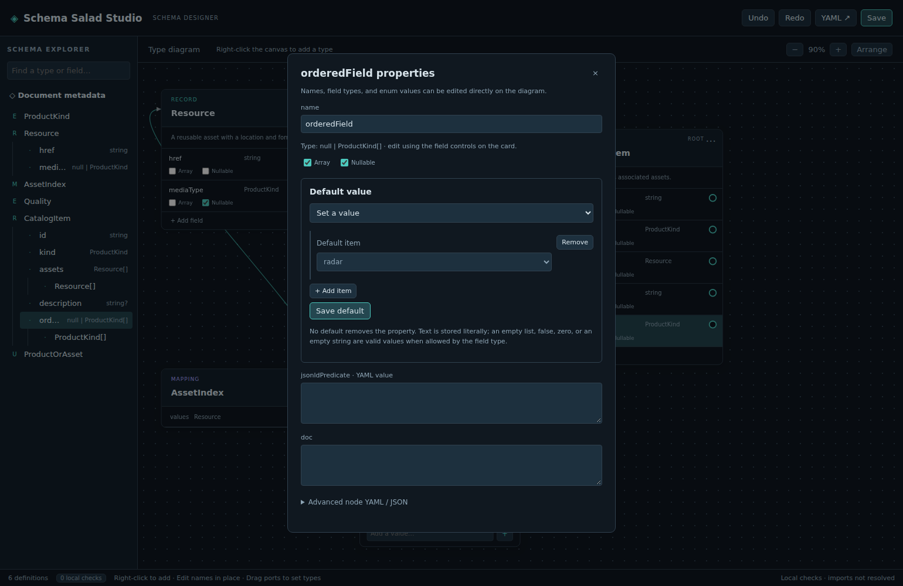

# Set a field default

Use this procedure when a record field needs an explicit default. Start with a schema containing a field, such as `Asset.kind` from the [first-schema tutorial](../tutorials/first-schema.md).

1. Right-click the field and choose **Properties…**.
2. Under **Default value**, choose **Set a value**.
3. Enter a value using the control for the field's type. For `Asset.kind`, choose `image` from the enum dropdown.
4. Click **Save default** to commit the value, then save the document normally.

To remove a default, choose **No default** and click **Save default**. To use a null default, make the field nullable and choose **Null** when offered. No default, null, empty text, false, zero, and an empty list are distinct values.

If you change a field's type and its existing default becomes incompatible, the editor preserves the value and reports the problem in local checks. Reopen the default form to correct or remove it.

See the [field and default-value reference](../reference/field-controls.md) for supported controls, nesting, and validation limits.
