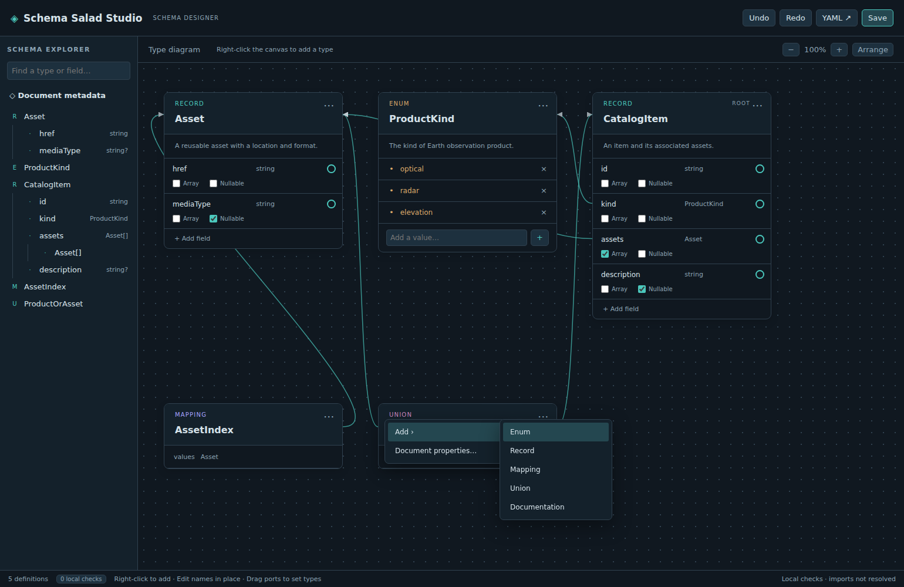

# Create your first schema

Build a small schema with an enum and a record that refers to it. You will create definitions, connect a field, and inspect the saved YAML.

## Before you start

[Install the 0.1.0 VSIX](../how-to/install-and-open.md) in VS Code 1.90 or later.

## Create an empty document

1. Run **Schema Salad: New Schema** from the Command Palette.
2. Save the file as `asset.salad.yaml`.

The editor opens an empty canvas. The source starts as `[]`.

## Add an enum

1. Right-click the canvas and choose **Add → Enum**.
2. Click the new type's name, enter `AssetKind`, and press Enter.
3. In the enum's value list, enter `image` and press Enter. Add `table` the same way.

You now have a named type with two literal string symbols.

## Add a record and connect its field

1. Right-click a different part of the canvas and choose **Add → Record**.
2. Rename it to `Asset`.
3. Click **+ Add field**, enter `kind`, and press Enter.
4. Drag the field's circular port to the `AssetKind` card and release.

The field type becomes `AssetKind`, and a reference arrow connects the cards. Leave **Array** and **Nullable** unchecked for this field.



The screenshot illustrates the editor with a larger schema; your document has only two cards.

## Save and inspect the source

Click **Save** or press Ctrl+S, then use **YAML ↗** to view the document. It contains the equivalent of:

```yaml
- name: AssetKind
  type: enum
  symbols:
    - image
    - table
- name: Asset
  type: record
  fields:
    - name: kind
      type: AssetKind
```

Additional properties or a different key order may appear. The enum precedes the record because the record depends on it.

You have created and saved a schema using the canvas. Next, [set a default for `kind`](../how-to/set-defaults.md), or explore [other editing operations](../how-to/edit-schema.md).
